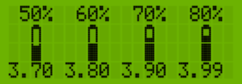

# SmoothProgress


Library for displaying smooth progress bars on the character based LCD displays for Arduino

SmoothProgress is a library for displaying horizontal or vertical progress bars on a character based LCDs like Hitachi HD44780 16x2 or 20x4.
Relies on the underlaying [LiquidCrystal](https://www.arduino.cc/en/Reference/LiquidCrystal), [LiquidCrystal_I2C](https://www.arduino.cc/reference/en/libraries/liquidcrystal-i2c/) library (and should work on any platform that supports this library or similar).
The length and the position of the progress bar can be configured. 

The library utilizes the user definable characters of the character LCD display and can display up to 4 independent horizontal or vertical smooth progress bars simultaneously. The progress bars can be drawn using different visual styles (distributed with the library as separate .h files or the user can define its own style). The styles are defined by bit-masks and additional data in the struct **barstyle** (49 bytes) that can be stored in SRAM or in flash (PROGMEM).
The library also supports progress bars on multiple connected LCD displays - each display with possibly different progress bar style, 4 progress bars per display.

# Connections
All interfacing to the lcd is handled by the built in Arduino `LiquidCrystal`, `LiquidCrystal_I2C`, `hd44780` or simmilar library, meaning that the `SmoothProgress` library has no extra requirements on top of the mentioned libraries for how the display is connected. `SmoothProgress` should work with almost any library for the character LCD displays based on the Hitachi HD44780 or compatible controllers that implements write(uint8_t), setCursor(uint8_t, uint8_t) and createChar(uint8_t, uint8_t[]) methods. Just include SmoothProgress.h **after** including the LiquidCrystal library.

# Getting started
## Installing the library
... hopefully it will be addad to Arduino libarary manager soon...

## Including in your sketch
Add these lines to the top of your sketch:
First include the LiquidCrystal library <LiquidCrystal.h> or <LiquidCrystal_I2C.h> (dependig on how your LCD is connected). 

```c++
// Libraries to include
//#include <LiquidCrystal_I2C.h> 
#include <LiquidCrystal.h> 
#include <LiquidCrystal.h>
```

After that include the SmoothProgress library
```c++
#include <SmoothProgress.h>
```

## Progress bar styles
SmoothProgress library supports displaying the progress bars using different visual styles. Several styles are supplied with the library as separate .h files.
In order to display the smooth progress bar an appropriate style must be defined for the progress bar. 
The library is accompanied with a collection of several different progress bar styles - just include the appropriate header file <BarStyleXX.h> and configure the BarDisplay object. The bitmasks can be stored in memory or in flash (PROGMEM) to save space.
The heared file(s) with the definition of the style(s) to be used with the progress bars should be included next.
For examle to use a style for horizontal progress bar as a square frame with 1 pixel margin BarStyle1.h should be included

```c++
#include <BarStyle1.h>
```

## LCD display object
Next define the  object for the LCD display as usual (or as recommended for the used liquid crystal library depending on how it is connected)
For example:

```c++
const int rs = 12, en = 11, d4 = 5, d5 = 4, d6 = 3, d7 = 2;
LiquidCrystal lcd(rs, en, d4, d5, d6, d7);
```

or

```c++
LiquidCrystal_I2C lcd(0x27, 16, 2);  
```

if you use a LCD display with an I2C extender board.

## LCD **display object** to progress bar **style** association
The library supports multiple progress bars (up to 4) on a single display.
The smooth progress bars are "drawn" using the user definable characters that are appropriately programmed with appropriate image to be used in showing the progress.
Since these displays have only 8 user definable characters, only 4 progress bars can be supported at a time.
 * Each progress bar is "drawn" by printing (in general) 5 different user defined characters:
 *   1. one on the left edge  
 *   2. one in the middle that is completely full (left of the growing edge) 
 *   3. the character representing the growing edge that is partially filled
 *   4. one in the middle that is completely blank (right of the growing edge) 
 *   5. one on the right edge  
 * Except for the character representing the growing edge, the other 4 are common for all progress bars on the display.
 * 4 common + 4 growing edges = 4 independent progress bars at once
The hardware limitation of the character LCD displays dictates that all progress bars on a single display have to share the same style, so the progress bar style is linked to a single LCD display regardless of the number of progress bars (1-4) to be shown.
Next we have to create an association  between the LiquidCrystal display and the progress bar style as a separate BarDisplay (LCD) object (dispA in the examle) to be used when creating the  objects representing the smooth progress bars and manipulating their style

```c++
LCD dispA(lcd, barStyle1);
```

##Creating the Smooth brogress bar objects

```c++
SmoothProgressBar spb1(dispA, 10, 0, 0, 0); // progress bar 10 characters wide, at 0-th row, 0-th column, as progress bar 0
SmoothProgressBar spb2(dispA, 12, 0, 1, 1); // progress bar 12 characters wide, at 1-th row, 0-th column, as progress bar 1
```

SmoothProgressBar SmootProgBarObj(DisplayAssociationObject, ProgressBarSize, PositionColumn, PositionRow, id_number)

In the setup() first initialize the LiquidCrystal object as usual when usin a LCD display, and then initialize the association (style to display) object by calling its begin() function

```c++
void setup()
{
    lcd.begin(16, 2); // do the usual lcd initialization for the used liquid crystal library
...
    // also initialize the bar_display object (loads the style)
    dispA.begin();
...
}
```

You can show the progress bar calling showProgressPct() and specifying the percentage [0-100] to be filled 

```c++
spb.showProgressPct(p);
...
spb.showProgress(i);
```

or you can use showProgress() method and specifying the absolute number of columns to be filled. 
The length in pixel columns of the progress bar can be found by calling the size() method.

Some examples using the library:

 

 

 

 

 

Examples (in the exmaples foledr) - you can see them live in the Wokwi simulator:

[VericalProgessBar](https://wokwi.com/projects/340162249626747475)

[VericalProgessBarTemp](https://wokwi.com/projects/340162445985186388)

[BatteryGauge](https://wokwi.com/projects/340161967281930834)

Known limitations:
 - at most 4 independent progress bars can be shown (restricted by the limitation of only 8 user definable characters on these displays)
 - all progress bars on the LCD share the same style (due to hardware limitations of only 8 user definable characters on these displays)
 - the progress bars are "drawn" by printing over all the characters defining the progress bar on every call of showProgress

So here it is, hopefully someone else can find a use of it (or make a comment).
Until a better guide is written...
for further explanation on the usage:
- see the [examples](examples) 
- see the docs in docs/html/index.html
- see the comments in the code

